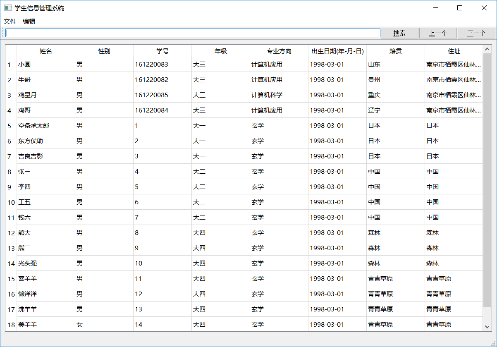
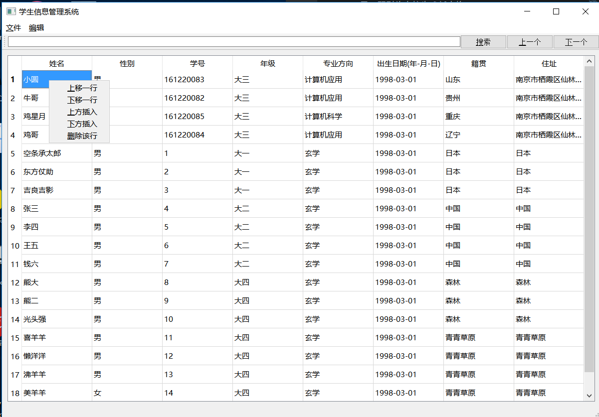
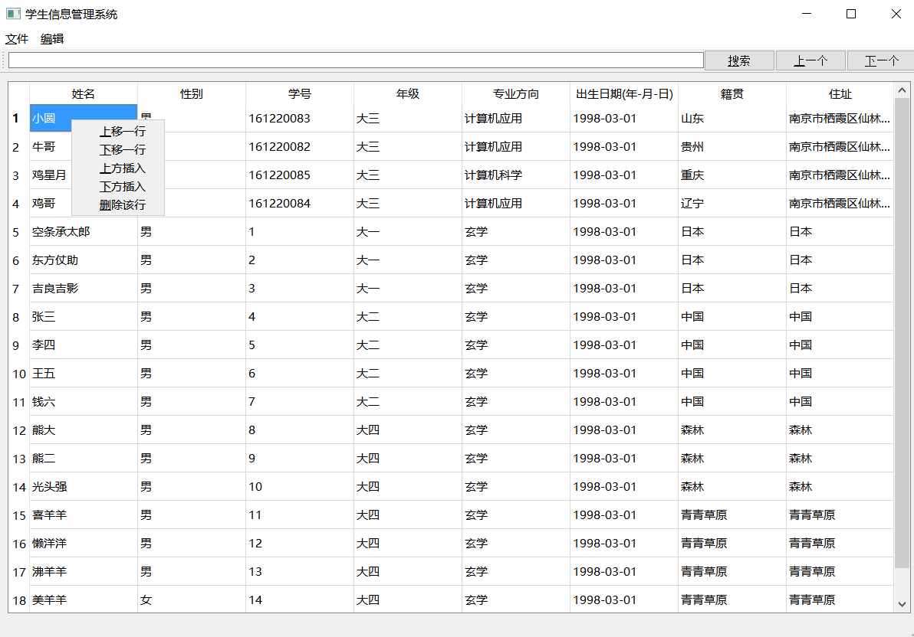
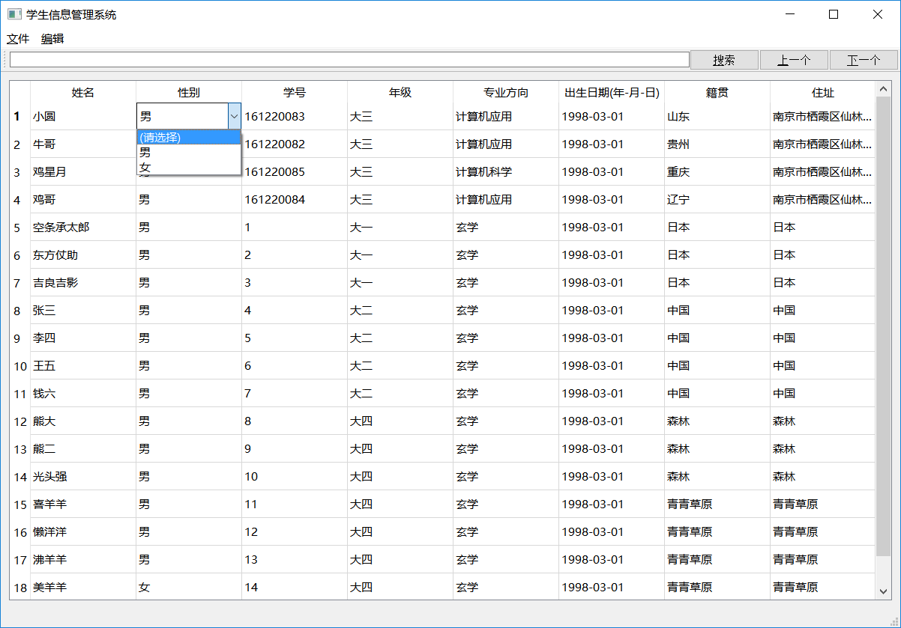
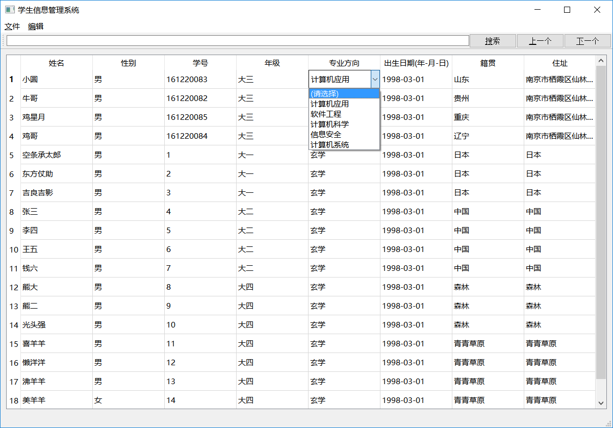
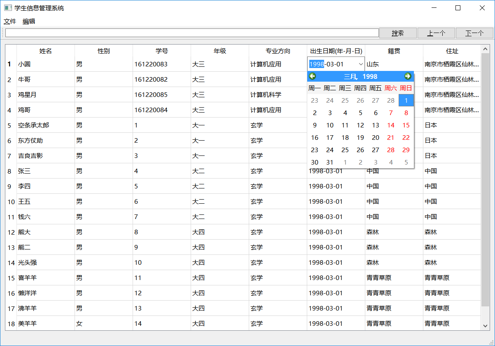
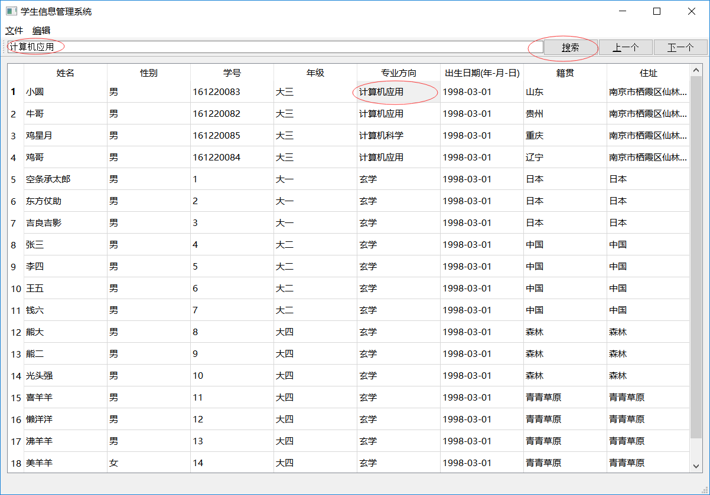
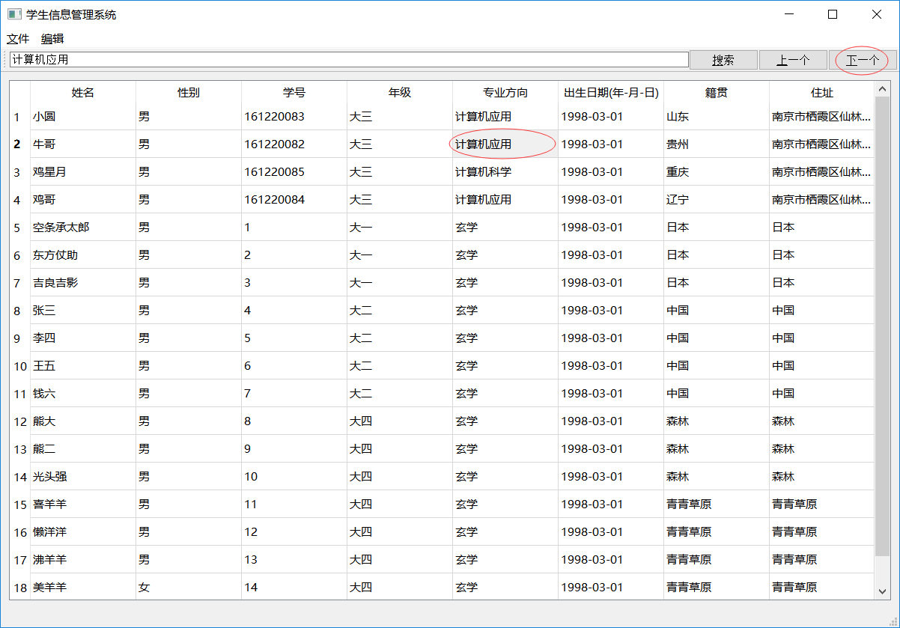
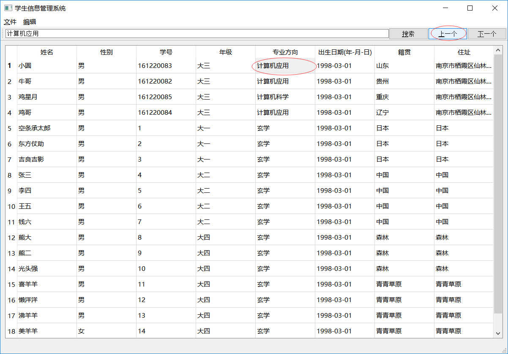
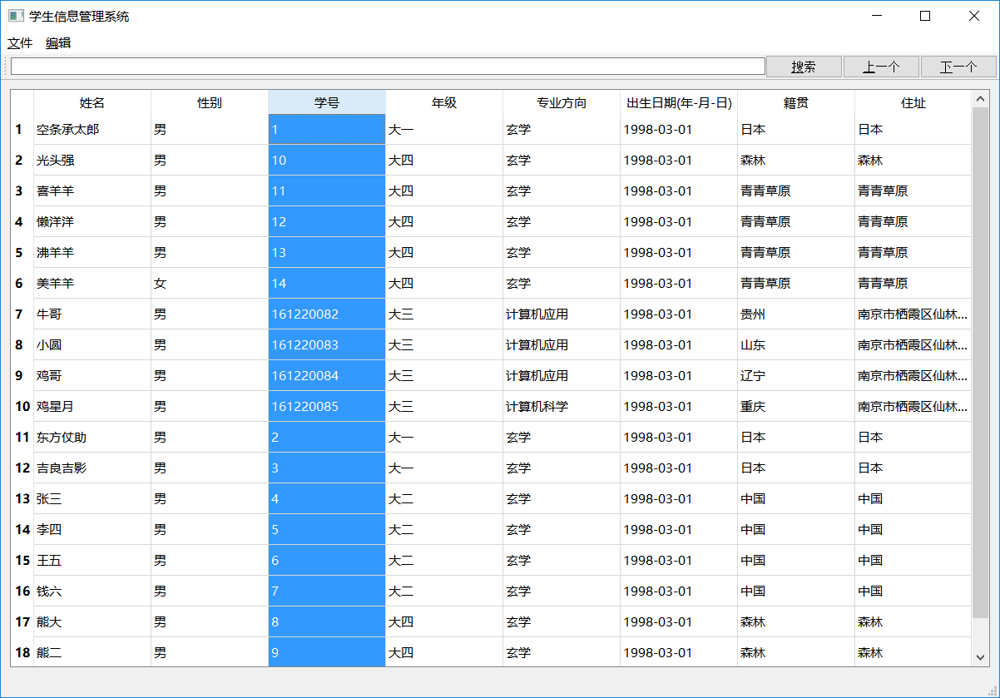

# 学生信息管理系统
刘潇远\
161220083\
南京大学计算机系\
大三本科生

## 一、系统指南
本系统为表格式的学生信息管理系统，提供了文件新建、打开及保存功能，还可在表格中对数据进行增加、删除、修改、搜索，下面将一一介绍这些功能

### 1、新建文件
新建文件将会产生一个全新的空表格，在新建文件时，当前表格的内容将会被删除，系统会自动检测当前表格内容是否已经被保存过，如果未保存过的，会对用户进行提示；否则将直接生成新表格
### 2、打开文件
系统可以打开由系统保存的、符合系统规范的.csv文件。
### 3、保存文件
系统将当前表格保存为.csv文件。之所以保存为.csv文件，除了考虑到这种文件具有非常规整的模式之外，还考虑到该格式可使用微软*excel*表格打开，便于实际场景中的使用。
### 4、增加
在系统菜单栏编辑项中和系统右键菜单中，有三种方式对表格数据进行增加，分别是“增加一行”，“上方插入一行”和“下方插入一行”。\
点击“增加一行”，会在表格末尾生成一行空行。\
点击“上方插入一行”，会在当前选中表格的上方插入一行空行。\
点击“下方插入一行”，会在当前选中表格的下方插入一行空行。\


### 5、删除
在系统菜单栏编辑项中和系统右键菜单中，提供了“删除”选项。\
点击删除选项之后，当前选中的行会被删除掉。
### 6、修改
双击表项即可进入编辑模式，对表格内容进行编辑。其中性别、专业和出生日期栏还提供了下拉选择项，便于使用者对其进行编辑。



### 7、搜索
系统工具栏中有一个搜索文本框，用户只需要在框中输入搜索内容，之后点击窗口右边的“搜索”按钮即可进行搜索。除了搜索按钮以外，还有“上一个”和“下一个”按钮，用以继续查询。



### 8、排序
若要按照某个属性进行排序，只需要双击该属性表头即可。首次点击按照字符正序按该列对表格进行扩展排序，再次点击进行倒序排序，再次点击又变为正序排序，以此类推。搜索仅支持精确搜索，不支持模糊搜索。

## 二、系统实现
本系统主要由三个继承类构成，一个是*MianWindow*类，它继承自*QMainWindow*类，是系统的主要部分，另外两个类为*Delegate*和*DateDelegate*类，它们都继承自*QItemDelegate*类，用以实现表项中的下拉选项，前者实现了性别和专业方向下拉选项，后者实现了出生日期的下拉选项。\
*MainWindow*类中还集成了*QAction*类、*QWidget*类、*QLayout*类、*QTableWidget*类、*QLineEdit*类、*QPushButton*类、*QString*类。**_请注意，系统中出现的其他Qt类，以及dialog.cpp、student.cpp、studentdatabase.cpp和他们对应的头文件中封装的类，仅为系统实现过程中的遗产代码，在系统中不发挥作用，仅为日后留作他用。_**~~其实就是懒得删掉。~~
### 1、MainWindow类
MainWindow类属性和接口定义如下
```javascript
class MainWindow : public QMainWindow
{
    Q_OBJECT

public:
    explicit MainWindow(QWidget *parent = 0);
    ~MainWindow();
protected:
    void closeEvent(QCloseEvent *event);
private:
    Ui::MainWindow *ui;
    //文件保存标识符
    bool saved;
    
    QWidget *widget;

    //布局管理器
    QLayout *layout;

    //表格及其初始化函数
    QTableWidget *table;
    void tableInitialize();

    //菜单栏选项
    QAction *newAction;
    QAction *openAction;
    QAction *saveAction;
    QAction *exitAction;
    QAction *addAction;
    QAction *deleteAction;
    QAction *moveUpAction;
    QAction *moveDownAction;
    QAction *insertAction;
    
    //排序辅助数组。用于实现对某属性的第奇数次为正排，偶数次为倒排
    bool c[8];
    
    //储存有表格下拉选项的QComboBox
    QVector<QComboBox*> *QComboBoxList;

    //工具栏搜索的文本框、三个按钮和搜索关键词
    QLineEdit *searchQLineEditToolBar;
    QPushButton *searchButton;
    QPushButton *lastButton;
    QPushButton *nextButton;
    //搜索文本
    QString searchQstr;
    //当前搜索到的表格位置
    int searchRow;
    int searchColumn;

    //快速排序，按照字符串比较顺序   
    int partition(int p, int q, int column);
    void quickSort(int p, int q, int column);
    void Swap(int p1,int p2, int column);

    //表项右键菜单
    virtual void contextMenuEvent(QContextMenuEvent *event);

private slots:
    //响应函数们

    //新建文件
    void newFile();
    //打开文件
    void openFile();
    //保存文件
    void saveFile();
    //表格末尾增加一行
    void addModify();
    //菜单栏中的删除当前行
    void deleteModify();
    //菜单栏中的当前行上移一行
    void moveUpModify();
    //菜单栏中的当前行下移一行
    void moveDownModify();
    //按照选定属性进行排序
    //参数是选定属性所在列的索引
    void sortView(int colunmIndex);
    //表格修改
    //表格修改后，将saved改为false，标识文件未保存
    void tableModify(int row,int column);
    //在当前行上一行插入空行
    void insertBefore();
    //在当前行下一行插入空行
    void insertAfter();
    //右键菜单中的删除当前行
    //实际上与菜单栏中的删除当前行响应函数（void deleteModify()）没有区别
    void deleteLine();
    //搜索文本获取
    //每当搜索文本框中内容改变时，调用该函数对搜索文本searchQstr进行赋值
    void searchQlineEditChanged(QString qstr);
    //搜索按钮响应函数
    //执行搜索，搜出第一个符合的位置并选中高亮。搜不到的话表格不会有任何变化。
    void searchToolBarTriggered();
    //搜索上一个
    void lastToolBarTriggered();
    //搜索下一个
    void nextToolBarTriggered();
};
```
### 2、Delegate类
Delegate类继承自QDelegate类，用以实现的性别和专业自定义委托。Delegate类属性和接口定义如下
```javascript
class Delegate : public QItemDelegate
{
    Q_OBJECT

public:
    
    Delegate(QObject *parent = nullptr);
    ~Delegate();
    //绘制下拉选项菜单
    void paint(QPainter *painter, const QStyleOptionViewItem &option,
        const QModelIndex &index) const;
    //下拉选项大小
    QSize sizeHint(const QStyleOptionViewItem &option, const QModelIndex &index) const;
    //创建自定义按钮
    QWidget *createEditor(QWidget *parent, const QStyleOptionViewItem &option, const QModelIndex &index) const;
    //设置自定义按钮内容
    void setEditorData(QWidget *editor, const QModelIndex &index) const;

    void setModelData(QWidget *editor, QAbstractItemModel *model, const QModelIndex &index) const;

private:

};
```
### 3、DateDelegate类
DateDelegate类也继承自QDelegate类，用以实现出生日期的自定义委托，DateDelegate类属性和接口定义如下
```javascript
class DateDelegate : public QItemDelegate
{
    Q_OBJECT

public:
    DateDelegate(QObject *parent = nullptr);
   ~DateDelegate();

    //返回改变Model数据的widget，该widget是经过定制行为的Widget
    QWidget *createEditor(QWidget * parent, const QStyleOptionViewItem & option, const QModelIndex & index) const;

    //将可操作的数据提供给widget
    void setEditorData(QWidget * editor, const QModelIndex & index) const;
    
    //将widget的数据展示到Item中
    void setModelData(QWidget * editor, QAbstractItemModel * model, const QModelIndex & index) const;  

    //确保widget能够正确显示到view中
    void updateEditorGeometry(QWidget * editor, const QStyleOptionViewItem & option, const QModelIndex & index) const;
private:

};
```
